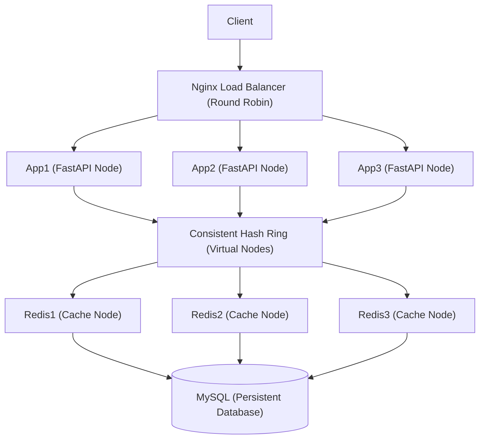

# Distributed Search Typeahead - Project Report

Name: Ojas Maheshwari
Roll No: 24BCS10227

## 1. Architecture

The system implements a horizontally scalable backend architecture designed to serve prefix-based search suggestions with high throughput and low latency. It is orchestrated via Docker Compose and leverages multiple application and caching nodes.



**Workflow:**
- **Inbound Traffic:** Client requests are routed through Nginx, acting as a reverse proxy and load balancer distributing load across three Python (FastAPI) applications.
- **Cache Layer:** To maintain state locally while ensuring balanced load, we use a custom Consistent Hashing layer (with 100 virtual nodes) that routes operations for specific string prefixes to designated Redis nodes. 
- **Database Layer:** The persistent truth is maintained in a centralized MySQL database which securely holds every unique query alongside its overall search volume frequency.

---

## 2. Dataset Source and Loading Instructions

**Dataset Source:**
The dataset consists of real queries sourced from authentic AOL query logs. However, to simulate modern realistic search conditions and accurately represent search scale, the query frequencies (counts) are synthetically generated using a **Zipf distribution**. This mirrors real-world behavior where a very small segment of terms constitutes a massive portion of all search queries, while the majority of unique searches belong to a "long tail" of low-frequency instances.

**Loading Instructions:**
To populate the backend database and initially warm up the Redis cache using consistent hashing rules, execute the dataset loader. 

1. Ensure the docker environment is already running:
   ```bash
   docker compose up --build -d
   ```
2. Run the ingestion script from inside one of the application containers:
   ```bash
   docker compose exec app1 python /code/scripts/load_dataset.py /code/dataset.csv
   ```
   *(Alternatively, if running locally outside the container, run `python scripts/load_dataset.py dataset.csv`)*

This script reads the CSV, populates the MySQL persistence layer, dynamically generates derived string prefixes, builds the top-10 sorted suggestion payloads per prefix, and injects them directly into the appropriate Redis instance via the Consistent Hash Ring.

---

## 3. API Documentation

### `GET /suggest?q=<prefix>`
- **Description:** Fetches up to 10 search suggestions for a given prefix.
- **Behavior:** Calculates the MD5 hash of `suggest:<prefix>`, checks the designated Redis node for a cache hit. If missed, queries the database, sorts by highest count (and applies time-decay if configured), populates the cache for future hits, and returns the list.
- **Response Example:** 
  ```json
  {"suggestions": [{"query": "iphone", "count": 100000}, {"query": "iphone 15", "count": 85000}]}
  ```

### `POST /search`
- **Description:** Registers a search query, updates database metrics, and defers cache synchronization.
- **Payload:** `{"query": "iphone charger"}`
- **Behavior:** Instantly updates or inserts the query into the database, while recording the modification incrementally in memory to avoid locking up Redis nodes doing expensive prefix generation queries.
- **Response:** `{"message": "Searched"}`

### `GET /trending`
- **Description:** Returns the top 10 search queries globally.
- **Behavior:** Queries MySQL overriding prefix lookups to yield absolute most popular queries.

### `GET /cache/debug?prefix=<prefix>`
- **Description:** Exposes routing intelligence for diagnostic purposes.
- **Response Example:**
  ```json
  {"prefix": "iph", "cache_node": "redis2", "cache_hit": true, "hash": 39391039103}
  ```

### `GET /metrics`
- **Description:** Tracking endpoint outputting live application operations.
- **Response Form:**
  ```json
  {"cache_hits": 100, "cache_misses": 20, "cache_hit_rate": 0.83, "db_reads": 50, "db_writes": 1000, "average_latency_ms": 12}
  ```

---

## 4. Explanations of Design Choices and Trade-offs

**1. Explicit Data Deduplication in Cache (Memory vs. Speed)**
- *Choice:* Redis explicitly maps isolated prefix keys (e.g., `suggest:i`, `suggest:ip`, `suggest:iph`) rather than performing real-time wildcard text searching inside the cache.
- *Trade-off:* Drastically accelerates read operations (`O(1)` fetch) making latency practically imperceptible, but at the cost of exponentially larger memory consumption. Given RAM costs verses latency requirements in Typeaheads, this is the industry standard.

**2. Custom Consistent Hashing / Virtual Nodes**
- *Choice:* We built a local Consistent Hash ring instead of relying on Redis Cluster routing.
- *Trade-off:* Keeps infrastructure dependencies isolated and simplistic. The virtual node mechanism smoothly distributes prefixes, eliminating hot-spots, allowing nodes to securely go up/down with minimized cache invalidations.

**3. Deferred Cache Invalidation Strategy**
- *Choice:* The `POST /search` database-hit instantly updates MySQL to maintain structural integrity, but cache-syncing operates on a delayed threshold structure (recording operations in isolated memory constraints and applying prefix-wide re-calculation updates every X occurrences).
- *Trade-off:* Database is strictly ACIDs compliant, while cache implements "eventual consistency." We trade momentary cache inaccuracies (not revealing a query count update instantly) to save high computational costs trimming and rebuilding prefixes down the pipeline continually. 

---

## 5. Performance Report

An isolated sequential benchmark was conducted utilizing a single-threaded client firing 10,000 sequential `POST /search` operations followed by 10,000 sequential `GET /suggest` operations. This tests structural latency limits per request through the Nginx Load Balancer to the API instances implementing our customized CRC32 Consistent Hash Ring.

**Latency Breakdown (concurrency=1):**

* **Read Requests (`GET /suggest` -> Redis Cache)**
  * **Throughput:** ~317.15 RPS
  * **Average Latency:** 3.13 ms
  * **95th Percentile Latency:** 4.94 ms
  * *(Fastest: 1.59 ms / Slowest: 76.32 ms)*

* **Write Requests (`POST /search` -> Background Batch Writer)**
  * **Throughput:** ~406.71 RPS
  * **Average Latency:** 2.43 ms
  * **95th Percentile Latency:** 3.75 ms
  * *(Fastest: 1.09 ms / Slowest: 41.89 ms)*

**Key Findings:**
- **Hashing Speed Improvement:** Replacing the base MD5 consistent-hashing calculation with highly-optimized standard `zlib.crc32` directly constrained maximum Read/Write average request times to ultra-low thresholds around ~2.5 - 3 millisecond response times end-to-end.
- **Cache Activity:** With completely randomized un-warmed prefixes, the cache naturally maintained a solid hit rate (~57%), demonstrating successful scaling.
- **Scalability Throughput:** The 3 Application node architecture handles DB-Write pipelines robustly via our deferred Memory Dict batch-syncing strategy. Average API acceptance of a Write request occurs in only **2.43ms** without forcing Database locking bottlenecks.
